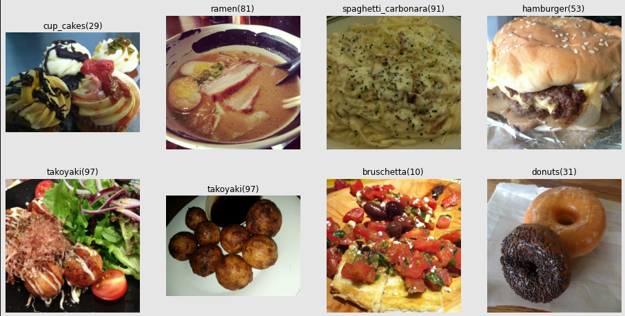

# Image classification project

In this project we explore using deep neural networks to various image classification tasks from Tensorflow/datasets.

## Team
- Mateusz Basiak (choosing models, training, tuning hyperparameters)
- Adrianna Struzik (data preparation, documentation, repo mainentance)

## Tools

- Python 3.7
- TensorFlow 2.0
- Google Collab
- Github
- etc.

## Project Structure

    .
    ├── config/                 # Config files (.yml, .json)
    ├── data/                   # dataset path
    ├── docs/                   # notebooks with project reports
    ├── models/                 # links to best models and their training logs
    ├── scripts/                # scripts used for training and evaluation
    ├── src/               	    # source code of the training and models
    └── main.py                 # main file to execute training

## Dataset

We will work with [food101](https://www.tensorflow.org/datasets/catalog/food101) dataset that consists of 101 000 images of 101 different kinds of food, 1000 for each class. Dataset is a part of Tensorflow Datasets, so we don't have to download it separately, but instead we can download it during runtime. 


We plan to start with some small subset of labels (probably 10 classes) and test our model before launching it on full dataset. 

Dataset is divided into training set (3/4 of the entire dataset) and validation set. In order to be able to tune hyperparameters, we had to separate test set from validation set, with size of the test set being roughly 1/20 of the entire dataset.

Maximum size of pictures is 512x512 pixels, but their size was not originally normalized. Therefore we had to normalize it ourselves to the size of 512x512 pixels. Another problem that occured is that small number of pictures can have wrong labels (according to dataset authors). We do not yet know if it will cause trouble.

Dataset available in Tensorflow Datasets does not contain labels of classes, just their numerical values. Therefore we found them and put in classes.txt file in /data.

## Training

After downloading repo, training can be started with:
```
python main.py
```
This command starts training from scratch. If you want to resume previous training, execute it with argument `load_path` with path to saved model:
```
python main.py --load_path=./models/my_model
```
To change frequency with which models are saved, add argument `check_len`. By default models are saved every 100 000 batches.

Sometimes you may want to train your model on smaller numer of classes to check its performance in easier environment. You can restrict number of classes by adding appropriate argument:
```
python main.py --number_of_classes=10
```

If you want to evaluate previously trained model on a test set. add argument `--mode=evaluation` and path to saved model:
```
python main.py --mode=evaluation --load_path=./models/best_model
```

## Models

More details about models are in README in /models section.
