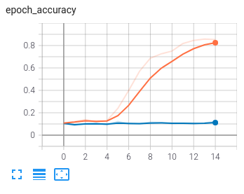
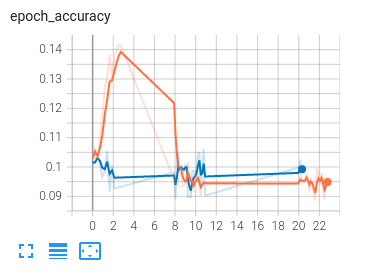
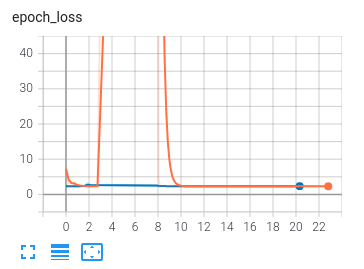
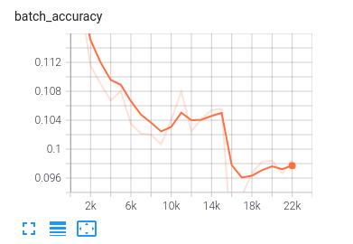

# Models

For each trained model we keep a separate directory with three subdirectories:

 - logs - with tensorboard logs for the training and validation. They can be accessed with:
```
tensorboard --logdir ./model_name/logs
```
 - checkpoints - with instances of the model saved during training
 - best - with model that achieved best accuracy during training

### model_1
First model that we trained is a basic, generic convolutional model, based on scheme from [here](https://www.tensorflow.org/tutorials/images/cnn). It was  not modified to fit the dataset, because its main role was to check if the infrastructure works properly. As expected, model behaves poorly and quickly overfits with training accuracy (orange line) exceeding validation accuracy (blue line).


After that we tried some classic tricks to overcome overfitting like adding dropout or expanding number of classes and size of the data. Unfortunately that didn't help. Then we tried to change parameters of the layers a bit: we created additional dense layers, we added kernels of convolution, etc. Those efforts also failed, as overfitting is still clearly visible:



### model_big

After failing with the previous model, we moved to a more involved approach, based on a [classical paper](https://papers.nips.cc/paper/2012/file/c399862d3b9d6b76c8436e924a68c45b-Paper.pdf). We tweaked it to fit our problem. Our new network has four convolutional layers with 16, 64, 64, 64 kernels. Between them are max polling layers. Then there are three dense layers with dropout and ReLU as an activation function.

Behaviour of this model can only be described as strange. After several epochs it stops learning its loss and accuracy stay the same in a long plateau. After performing some tests we discovered that it learned to output alweys the same class and therefore keeps getting accuracy around 10% for 10 classes.




When we tried to launch this model on the version of this problem with just two classes, previous problem did't occur, but instead models accuracy was embarrasingy low.

### model_dense

As a side project we tried to use dense network without any convolutional layers. It's result don't currently differ from others in that they are close to random. Therefore this model was abbandoned.


