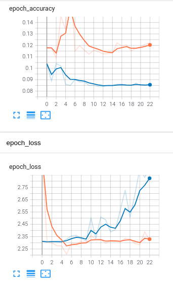

# Models

For each trained model we keep a separate directory with three subdirectories:

 - logs - with tensorboard logs for the training and validation. THey can be accessed with:
```
tensorboard --logdir ./model_name/logs
```
 - checkpoints - with instances of the model saved during training
 - best - with model that achieved best accuracy during training

### model_1
First model that we trained is a basic, generic convolutional model, based on scheme from [here](https://www.tensorflow.org/tutorials/images/cnn). It was  not modified to fit the dataset, because its main role was to check if the infrastructure works properly. As expected, model behaves poorly and quickly overfits with training accuracy (orange line) exceeding validation accuracy (blue line).

